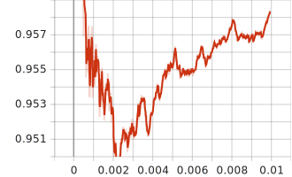

# pcap_classifier

利用神经网络对网络数据包进行分类

## 分类标记

VPN-nonVPN dataset (ISCXVPN2016) 数据集给出了一些 .pcap 文件，存储了各种流量的数据包，但是并没有直接给出每个包具体标记的编码，所以需要一种简单的编码方式，来描述每个文件具体的数据类型和应用类型。这些类型的分类在 [classify.py](./src/classify.py) 文件中给出，分别定义了每种类型的数据，以及应用程序的编码。以便于后期分类中的处理。

## 数据处理

VPN-nonVPN dataset (ISCXVPN2016) 提供了许多的 .pcap 包，可以直接使用 scapy 包对其进行处理，截取以太网帧负载的前 1024 个字节，对于不够 1024 字节的，用 0 填充。

对于每个包数据，以及相应的分类标记，作为一个元组 (tuple) 存储，将所有的数据包信息存储在一个列表中，整体持久化成一个 pickle 文件，这样好比直接存储大量的图片性能更高。

对于一些意义不大的数据包进行了丢弃处理，比如 TCP 中标记了 SYN, ACK, FIN 的包，这些包并没有实际的负载，所以可以认为是噪声，还有用于 DNS 解析的包，也和实际应用关系不大。

最后利用 random_split() 函数将整体数据集，随机的切分成训练集和测试集，验证模型在尽可能随机的情况下的分类性能。

## 模型优化

原模型对网络包进行了图像化处理，利用二位卷积操作进行分类，实现了不错的效果，不过网络包并没有显然的二位空间上的相关性，而直接进行图像处理的形式，显然说不通，于是将二位卷积换成一维卷积，也同样的到了不错的效果。在同样的数据集的情况下，得到了更好的分类性能。

## 分类结果

对每个文件的数据集取最多 1024 条，其中 5% 作为测试集，其余用于训练集。

---

### vpn 2 分类

此次实验只对全体数据集做 vpn 2 分类，分类结果如下：

分类测试性能图：

| 训练准确率                               | 训练损失                                  | 测试准确率                                |
| ---------------------------------------- | ----------------------------------------- | ----------------------------------------- |
|  |  |  |

| 正确数量 | 全部数量 | 正确率 |
| -------- | -------- | ------ |
| 6661     | 6663     | 0.9996 |

下面为对应每个类型的正确率：

| nonvpn | vpn |
| ------ | --- |
| 0.999  | 1.  |

----

### type 6 分类

此次实验只对全体数据集做数据类型 6 分类，不区分 app 和 vpn，分类结果如下：

---

### app 16 分类

对 vpn 和 非 vpn 不做区分，只关注具体的 app，分类结果如下：

分类测试性能图：

| 训练准确率                                | 训练损失                                   | 测试准确率                                 |
| ----------------------------------------- | ------------------------------------------ | ------------------------------------------ |
|  |  |  |

| 正确数量 | 全部数量 | 正确率 |
| -------- | -------- | ------ |
| 6386     | 6663     | 0.958  |

下面为对应每个 app 的正确率：

| aim  | email | facebook | ftp  | gmail | hangouts | icq  | netflix |
| ---- | ----- | -------- | ---- | ----- | -------- | ---- | ------- |
| 0.86 | 0.87  | 0.95     | 0.98 | 0.93  | 0.96     | 0.90 | 0.97    |

| scp  | sftp | skype | spotify | vimeo | voipbuster | youtube | bittorrent |
| ---- | ---- | ----- | ------- | ----- | ---------- | ------- | ---------- |
| 0.96 | 0.99 | 0.97  | 0.96    | 0.97  | 0.98       | 0.98    | 1.         |

---

## 参考文献

1. <https://www.unb.ca/cic/datasets/vpn.html>
2. G. Draper-Gil, A. H. Lashkari, M. S. I. Mamun, and A. A. Ghorbani, “Characterization of encrypted and vpn traffic using time-related,” in Proceedings of the 2nd international conference on information systems security and privacy (ICISSP), 2016, pp. 407–414.
3. <https://github.com/AidenZhang1998/Network-traffic-classification>
4. <https://blog.munhou.com/2020/04/05/Pytorch-Implementation-of-Deep-Packet-A-Novel-Approach-For-Encrypted-Tra%EF%AC%83c-Classi%EF%AC%81cation-Using-Deep-Learning/>
